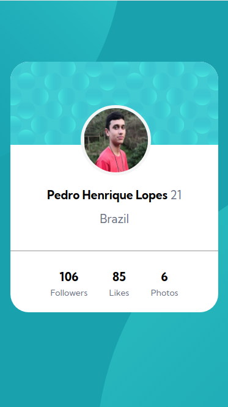

# Profile Card Component - Frontend Mentor

[Projeto extraído do site Frontend Mentor](https://www.frontendmentor.io/challenges/profile-card-component-cfArpWshJ), cujo objetivo é colocar minha habilidades em prática, e aprender novas habilidades no decorrer do processo de desenvolvimento da solução para o projeto proposto.

<h2>O Desafio</h2> 

Com base no design fornecido, o desafio consiste em desenvolver, para desktop e mobile, um card de perfil utilizando HTML e CSS. 

<h2>Aprendizados</h2>

- Pude aperfeiçoar a forma de pensar e escrever um documento HTML.
- No CSS pude fixar a utilização de shorthands e seletores. Além de explorar e perceber a necessidade de estudar mais sobre como posicionar de maneira mais consciente os elementos na tela.

<h2>Screenshots</h2>

<h3>Desktop Design</h3>

<h3>Mobile Design</h3>

